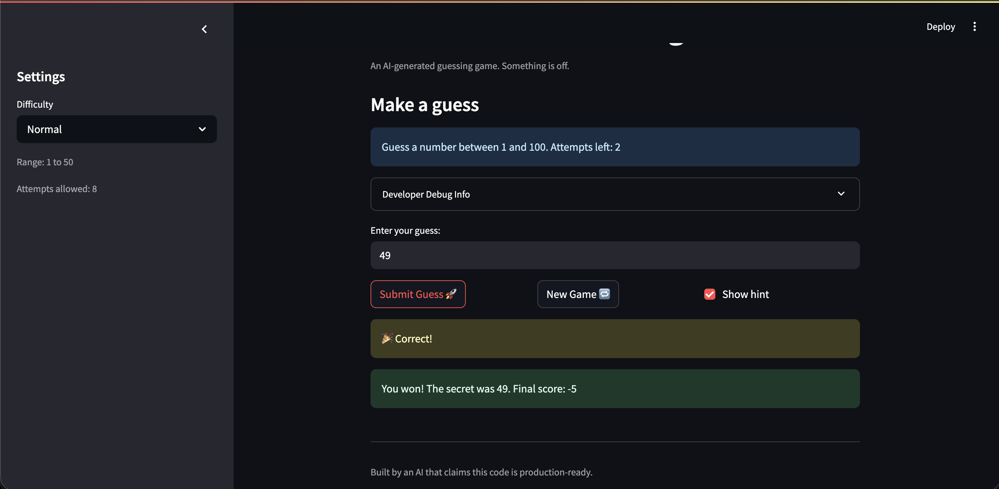

# 🎮 Game Glitch Investigator: The Impossible Guesser

## 🚨 The Situation

You asked an AI to build a simple "Number Guessing Game" using Streamlit.
It wrote the code, ran away, and now the game is unplayable. 

- You can't win.
- The hints lie to you.
- The secret number seems to have commitment issues.

## 🛠️ Setup

1. Install dependencies: `pip install -r requirements.txt`
2. Run the broken app: `python -m streamlit run app.py`

## 🕵️‍♂️ Your Mission

1. **Play the game.** Open the "Developer Debug Info" tab in the app to see the secret number. Try to win.
2. **Find the State Bug.** Why does the secret number change every time you click "Submit"? Ask ChatGPT: *"How do I keep a variable from resetting in Streamlit when I click a button?"*
3. **Fix the Logic.** The hints ("Higher/Lower") are wrong. Fix them.
4. **Refactor & Test.** - Move the logic into `logic_utils.py`.
   - Run `pytest` in your terminal.
   - Keep fixing until all tests pass!

## 📝 Document Your Experience

- [The games purpose is to simulate a number guessing game.] Describe the game's purpose.
- [I found bugs with logic for when the answer is incorrect (Showing higher when should be lower and lower for when it needed to be higher), secret not changing when difficulty changes, secret is not in the range of the difficulty, and Normal and Hard difficulties were flipped.] Detail which bugs you found.
- [I applied fixes to the logic for when the answer is incorrect answers by flipped the message for higher and lower, definied that the secret is initialized inside the range and resets when difficulty is first selected, and then swapped Normal and Hard difficulties.] Explain what fixes you applied.

## 📸 Demo

- [] [Insert a screenshot of your fixed, winning game here]

## 🚀 Stretch Features

- [N/A] [If you choose to complete Challenge 4, insert a screenshot of your Enhanced Game UI here]
